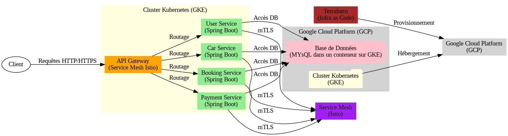

# Projet Car-Rental

## Objectif du Projet :
Le projet **Car-Rental** vise à développer un  backend  sécurisé d’une mini-application de location de voitures. L'application est basée sur une architecture microservices, déployée dans un environnement cloud, et utilise des technologies modernes pour assurer scalabilité, performance et sécurité. 

## Contexte Technologique :

- Le projet s'inscrit dans le cadre d'un cours sur les architectures cloud-native et les pratiques DevSecOps. Il met en œuvre les technologies suivantes : 

- Microservices : Développés en Java Spring Boot pour une modularité et une maintenabilité accrues. 

- Docker : Pour la conteneurisation des services. 

- Kubernetes : Pour l'orchestration des conteneurs et la gestion du cluster. 

- Google Cloud Platform (GCP) : Pour l'hébergement de l'infrastructure. 

- Terraform : Pour l'automatisation du déploiement de l'infrastructure (Infrastructure as Code). 

- Service Mesh (Istio) : Pour la gestion de la communication sécurisée entre les services. 

## Architecture simplifiée du Projet 
L'application est divisée en plusieurs microservices, chacun ayant une responsabilité spécifique. Voici un aperçu de l'architecture :
   ```
+-------------------+       +-------------------+       +-------------------+
|    Client         | ----> | API Gateway       | ----> | User Service      |
| (Navigateur/App)  |       | (Istio gateway )    |       | (Spring Boot)     |
+-------------------+       +-------------------+       +-------------------+
                                |                           |
                                v                           v
                    +-------------------+       +-------------------+
                    | Car Service       |       | Booking Service   |
                    | (Spring Boot)    |       | (Spring Boot)     |
                    +-------------------+       +-------------------+
                                |                           |
                                v                           v
                    +-------------------+       +-------------------+
                    | Payment Service   |       | Base de Données   |
                    | (Spring Boot)    |       | (MySQL dans un conteneur GKE)       |
                    +-------------------+       +-------------------+
                                |
                                v
                    +-------------------+
                    | Service Mesh      |
                    | (Istio)           |
                    +-------------------+
                                |
                                v
                    +-------------------+
                    | Terraform        |
                    | (Infra as Code)  |
                    +-------------------+
                                |
                                v
                    +-------------------+
                    | Google Cloud      |
                    | Platform (GCP)    |
                    +-------------------+


   ```

### Diagramme d'Architecture


## Architecture Globale :

L'application est divisée en plusieurs microservices, chacun ayant une responsabilité spécifique. L'architecture globale est la suivante : 

API Gateway : Un point d'entrée unique pour toutes les requêtes, qui les route vers les microservices appropriés. 

### Microservices : 

- User Service : Gère l'authentification et les informations des utilisateurs. 

- Car Service : Gère le catalogue des voitures disponibles. 

- Booking Service : Gère les réservations de voitures. 

- Payment Service : Gère les transactions de paiement. 

- Base de Données : Une base de données relationnelle (MySQL) stocke les données des utilisateurs, des voitures et des réservations. 

- Cluster Kubernetes : Les microservices sont déployés dans un cluster Kubernetes hébergé sur Google Kubernetes Engine (GKE). 

- Service Mesh (Istio) : Pour la gestion de la communication sécurisée entre les services et la configuration de l'api  gateway + virtual gateway vers les microservices. 

- Terraform : Automatise le déploiement de l'infrastructure sur GCP. 

Chaque  microservice est  une application autonome et développé séparément . 


## Technologies Utilisées
### Développement
- **Java Spring Boot** : Framework pour développer les microservices REST.
- **Service Mesh Istio** : Pour implémenter l'API Gateway.
- **Docker** : Pour conteneuriser les microservices.
- **Kubernetes** : Pour orchestrer les conteneurs et gérer le cluster.
- **Terraform** : Pour l'automatisation de l'infrastructure.

### Infrastructure
- **Google Cloud Platform (GCP)** :
  - **Google Kubernetes Engine (GKE)** : Pour héberger le cluster Kubernetes.
  - **Cloud Storage** : Optionnel, pour stocker des fichiers (par exemple, des images de voitures).
- **Service Mesh (Istio)** : Pour la communication sécurisée entre les services.

### Sécurité
- **RBAC (Role-Based Access Control)** : Pour gérer les permissions dans Kubernetes.
- **mTLS (Mutual TLS)** : Pour chiffrer la communication entre les services.
- **Docker Content Trust** : Pour signer et vérifier les images Docker.

## Pipeline CI/CD avec Terraform et Kubernetes

Cette etape décrit les étapes du pipeline CI/CD pour déployer  l'application de location de voitures sur Google Cloud Platform (GCP) en utilisant Terraform et Kubernetes. Le pipeline inclut des aspects de sécurité et d'optimisation.

## 1. **Configuration de Terraform**

### 1.1. **Fournisseurs**
- **Google Cloud** : Utilisé pour gérer les ressources GCP.
- **Kubernetes** : Pour déployer et gérer les ressources Kubernetes.
- **Helm** : Pour gérer les charts Helm dans le cluster Kubernetes.

### 1.2. **Backend GCS**
- **Bucket** : `car-rental-bucket-2` pour stocker l'état de Terraform.
- **Prefix** : `terraform/state` pour organiser les fichiers d'état.

### 1.3. **Configuration des Providers**
- **Google** : Projet `car-rental-project-453100`, région `europe-west1`, zone `europe-west1-c`.
- **Kubernetes** : Utilise le fichier de configuration `~/.kube/config`.
- **Helm** : Utilise également `~/.kube/config`.

## 2. **Déploiement des Ressources**

### 2.1. **Instance GCE**
- **Nom** : `terraform`
- **Type de machine** : `e2-medium`
- **Image** : `debian-cloud/debian-11`
- **Réseau** : `default` avec une IP publique.
- **Cycle de vie** : Création avant destruction pour éviter les temps d'arrêt.

### 2.2. **ClusterRole et ClusterRoleBinding**
- **ClusterRole** : `cluster-admin` avec accès à toutes les ressources.
- **ClusterRoleBinding** : Associe `cluster-admin` à l'utilisateur `admin`.

### 2.3. **PeerAuthentication et Gateway TLS**
- **PeerAuthentication** : Active le mTLS en mode `STRICT` dans `istio-system`.
- **Gateway TLS** : Configure une passerelle TLS pour `example.com` avec un certificat `my-certificate`.

## 3. **Déploiement des Services**

### 3.1. **MySQL**
- **Déploiement** : Utilise l'image `hamadygackou/mysql-custom:latest`.
- **Service** : Exposé en mode `LoadBalancer` sur le port `3306`.
- **Stockage** : Utilise un `PersistentVolumeClaim` pour `/var/lib/mysql`.

### 3.2. **phpMyAdmin**
- **Déploiement** : Utilise l'image `phpmyadmin/phpmyadmin`.
- **Service** : Exposé en mode `LoadBalancer` sur le port `80`.

### 3.3. **User-Service**
- **Déploiement** : Utilise l'image `hamadygackou/user-service:latest`.
- **Service** : Exposé en mode `ClusterIP` sur le port `80`.

### 3.4. **Booking-Service**
- **Déploiement** : Utilise l'image `hamadygackou/booking-service:latest`.
- **Service** : Exposé en mode `ClusterIP` sur le port `80`.

### 3.5. **Payment-Service**
- **Déploiement** : Utilise l'image `hamadygackou/payment-service:latest`.
- **Service** : Exposé en mode `ClusterIP` sur le port `80`.

### 3.6. **Car-Service**
- **Déploiement** : Utilise l'image `hamadygackou/car-service:latest`.
- **Service** : Exposé en mode `ClusterIP` sur le port `80`.

## 4. **Sécurité**

### 4.1. **mTLS**
- **PeerAuthentication** : Active le mTLS pour sécuriser les communications entre les services.

### 4.2. **RBAC**
- **ClusterRole et ClusterRoleBinding** : Limite les permissions aux utilisateurs et services nécessaires.

### 4.3. **TLS**
- **Gateway TLS** : Sécurise les communications externes avec des certificats TLS.

## 5. **Optimisation**

### 5.1. **Cycle de Vie**
- **Création avant destruction** : Minimise les temps d'arrêt lors des mises à jour.

### 5.2. **Ressources**
- **Limites de ressources** : Définit des limites de CPU et mémoire pour chaque service pour éviter la surconsommation.

Ce pipeline CI/CD utilise Terraform pour provisionner les ressources sur GCP et Kubernetes pour déployer les services. Les aspects de sécurité comme le mTLS, RBAC, et TLS sont intégrés pour protéger l'application. Les ressources sont optimisées pour minimiser les temps d'arrêt et éviter la surconsommation.

Ci  après le code terraform  complet associé au pipeline ci/cd  :

``` terraform
terraform {
  required_providers {
    google = {
      source = "hashicorp/google"
    }
    kubernetes = {
      source = "hashicorp/kubernetes"
    }
    helm = {
      source = "hashicorp/helm"
    }
  }

  # Configuration du backend GCS :end 
  backend "gcs" {
    bucket = "car-rental-bucket-2"    # Nom du bucket
    prefix = "terraform/state"        # Dossier pour stocker l'état
  }
}

provider "google" {
  project = "car-rental-project-453100"
  region  = "europe-west1"
  zone    = "europe-west1-c"
}

provider "kubernetes" {
  config_path = "~/.kube/config"
}

provider "helm" {
  kubernetes {
    config_path = "~/.kube/config"
  }
}

# Création de l'in-stance GCE uniquement si elle n'existe pas déjà
resource "google_compute_instance" "terraform" {
  name         = "terraform"
  machine_type = "e2-medium"
  tags         = ["web", "dev"]

  boot_disk {
    initialize_params {
      image = "debian-cloud/debian-11"
    }
  }

  network_interface {
    network = "default"
    access_config {
      # Configuration pour une IP publique
    }
  }

  allow_stopping_for_update = true

  lifecycle {
    create_before_destroy = true  # Créer la nouvelle instance avant de détruire l'ancienne
  }
}

# ClusterRole pour permettre l'accès à toutes les ressources
resource "kubernetes_cluster_role" "cluster_admin" {
  metadata {
    name = "cluster-admin"
  }

  rule {
    api_groups = [""]
    resources  = ["*"]
    verbs      = ["*"]
  }
}

# ClusterRoleBinding pour associer le ClusterRole à un utilisateur
resource "kubernetes_cluster_role_binding" "admin_binding" {
  metadata {
    name = "admin-binding"
  }

  role_ref {
    api_group = "rbac.authorization.k8s.io"
    kind      = "ClusterRole"
    name      = kubernetes_cluster_role.cluster_admin.metadata[0].name
  }

  subject {
    kind      = "User"
    name      = "admin"
    api_group = "rbac.authorization.k8s.io"
  }
}

# ClusterRole pour permettre l'accès à toutes les ressources
resource "kubernetes_cluster_role" "cluster_admin" {
  metadata {
    name = "cluster-admin"
  }

  rule {
    api_groups = [""]
    resources  = ["*"]
    verbs      = ["*"]
  }
}

# ClusterRoleBinding pour associer le ClusterRole à un utilisateur
resource "kubernetes_cluster_role_binding" "admin_binding" {
  metadata {
    name = "admin-binding"
  }

  role_ref {
    api_group = "rbac.authorization.k8s.io"
    kind      = "ClusterRole"
    name      = kubernetes_cluster_role.cluster_admin.metadata[0].name
  }

  subject {
    kind      = "User"
    name      = "admin"
    api_group = "rbac.authorization.k8s.io"
  }
}

# PeerAuthentication pour activer le mTLS
resource "kubernetes_manifest" "peer_authentication" {
  provider = kubernetes

  manifest = {
    apiVersion = "security.istio.io/v1beta1"
    kind       = "PeerAuthentication"
    metadata = {
      name      = "default"
      namespace = "istio-system"
    }
    spec = {
      mtls = {
        mode = "STRICT"
      }
    }
  }
}

# Gateway avec TLS
resource "kubernetes_manifest" "tls_gateway" {
  provider = kubernetes

  manifest = {
    apiVersion = "networking.istio.io/v1alpha3"
    kind       = "Gateway"
    metadata = {
      name      = "tls-gateway"
      namespace = "default"
    }
    spec = {
      selector = {
        istio = "ingressgateway"
      }
      servers = [
        {
          port = {
            number   = 443
            name     = "https"
            protocol = "HTTPS"
          }
          tls = {
            mode           = "SIMPLE"
            credentialName = "my-certificate"
          }
          hosts = ["example.com"]
        }
      ]
    }
  }
}

# Gateway avec TLS
resource "kubernetes_manifest" "tls_gateway" {
  provider = kubernetes

  manifest = {
    apiVersion = "networking.istio.io/v1alpha3"
    kind       = "Gateway"
    metadata = {
      name      = "tls-gateway"
      namespace = "default"
    }
    spec = {
      selector = {
        istio = "ingressgateway"
      }
      servers = [
        {
          port = {
            number   = 443
            name     = "https"
            protocol = "HTTPS"
          }
          tls = {
            mode           = "SIMPLE"
            credentialName = "my-certificate"
          }
          hosts = ["example.com"]
        }
      ]
    }
  }
}

# Déploiement Kubernetes pour MySQL
resource "kubernetes_deployment" "mysql" {
  metadata {
    name = "mysql"
  }

  spec {
    replicas = 1

    selector {
      match_labels = {
        app = "mysql"
      }
    }

    template {
      metadata {
        labels = {
          app = "mysql"
        }
      }

      spec {
        container {
          name  = "mysql"
          image = "hamadygackou/mysql-custom:latest"

          port {
            container_port = 3306
          }

          env {
            name  = "MYSQL_ROOT_PASSWORD"
            value = "password"
          }
          env {
            name  = "MYSQL_DATABASE"
            value = "carrentaldb"
          }
          env {
            name  = "MYSQL_USER"
            value = "user"
          }
          env {
            name  = "MYSQL_PASSWORD"
            value = "password"
          }

          resources {
            requests = {
              cpu    = "250m"
              memory = "500Mi"
            }
            limits = {
              cpu    = "500m"
              memory = "1Gi"
            }
          }

          volume_mount {
            name       = "mysql-persistent-storage"
            mount_path = "/var/lib/mysql"
          }
        }

        volume {
          name = "mysql-persistent-storage"
          persistent_volume_claim {
            claim_name = "mysql-pv-claim"
          }
        }
      }
    }
  }

  lifecycle {
    create_before_destroy = true  # Créer le nouveau déploiement avant de détruire l'ancien
  }
}

# Service Kubernetes pour exposer MySQL en mode LoadBalancer
resource "kubernetes_service" "mysql" {
  metadata {
    name = "mysql"
  }

  spec {
    selector = {
      app = "mysql"
    }

    port {
      port        = 3306
      target_port = 3306
    }

    type = "LoadBalancer"
  }

  depends_on = [kubernetes_deployment.mysql]

  lifecycle {
    create_before_destroy = true  # Créer le nouveau service avant de détruire l'ancien
  }
}

# Déploiement Kubernetes pour le user-service
resource "kubernetes_deployment" "user-service" {
  metadata {
    name = "user-service"
  }

  spec {
    replicas = 1

    selector {
      match_labels = {
        app = "user-service"
      }
    }

    template {
      metadata {
        labels = {
          app = "user-service"
        }
      }

      spec {
        container {
          name  = "user-service"
          image = "hamadygackou/user-service:latest"

          port {
            container_port = 8080
          }

          resources {
            requests = {
              cpu    = "100m"
              memory = "200Mi"
            }
            limits = {
              cpu    = "200m"
              memory = "400Mi"
            }
          }
        }
      }
    }
  }

  lifecycle {
    create_before_destroy = true  # Créer le nouveau déploiement avant de détruire l'ancien
  }
}

# Déploiement Kubernetes pour phpMyAdmin
resource "kubernetes_deployment" "phpmyadmin" {
  metadata {
    name = "phpmyadmin"
  }

  spec {
    replicas = 1

    selector {
      match_labels = {
        app = "phpmyadmin"
      }
    }

    template {
      metadata {
        labels = {
          app = "phpmyadmin"
        }
      }

      spec {
        container {
          name  = "phpmyadmin"
          image = "phpmyadmin/phpmyadmin"

          port {
            container_port = 80
          }

          env {
            name  = "PMA_HOST"
            value = "mysql"  # Nom du service MySQL
          }

          resources {
            requests = {
              cpu    = "100m"
              memory = "200Mi"
            }
            limits = {
              cpu    = "200m"
              memory = "400Mi"
            }
          }
        }
      }
    }
  }

  lifecycle {
    create_before_destroy = true  # Créer le nouveau déploiement avant de détruire l'ancien
  }
}

# Service Kubernetes pour exposer phpMyAdmin en mode LoadBalancer
resource "kubernetes_service" "phpmyadmin" {
  metadata {
    name = "phpmyadmin"
  }

  spec {
    selector = {
      app = "phpmyadmin"
    }

    port {
      port        = 80
      target_port = 80
    }

    type = "LoadBalancer"
  }

  depends_on = [kubernetes_deployment.phpmyadmin]

  lifecycle {
    create_before_destroy = true  # Créer le nouveau service avant de détruire l'ancien
  }
}

# Service Kubernetes pour exposer le user-service
resource "kubernetes_service" "user-service" {
  metadata {
    name = "user-service"
  }

  spec {
    selector = {
      app = "user-service"
    }

    port {
      port        = 80
      target_port = 8080
    }

    type = "ClusterIP"
  }

  depends_on = [kubernetes_deployment.user-service]

  lifecycle {
    create_before_destroy = true  # Créer le nouveau service avant de détruire l'ancien
  }
}

# Déploiement Kubernetes pour le booking-service
resource "kubernetes_deployment" "booking-service" {
  metadata {
    name = "booking-service"
  }

  spec {
    replicas = 1

    selector {
      match_labels = {
        app = "booking-service"
      }
    }

    template {
      metadata {
        labels = {
          app = "booking-service"
        }
      }

      spec {
        container {
          name  = "booking-service"
          image = "hamadygackou/booking-service:latest"

          port {
            container_port = 8080
          }

          resources {
            requests = {
              cpu    = "100m"
              memory = "200Mi"
            }
            limits = {
              cpu    = "200m"
              memory = "400Mi"
            }
          }
        }
      }
    }
  }

  lifecycle {
    create_before_destroy = true  # Créer le nouveau déploiement avant de détruire l'ancien
  }
}

# Service Kubernetes pour exposer le booking-service
resource "kubernetes_service" "booking-service" {
  metadata {
    name = "booking-service"
  }

  spec {
    selector = {
      app = "booking-service"
    }

    port {
      port        = 80
      target_port = 8080
    }

    type = "ClusterIP"
  }

  depends_on = [kubernetes_deployment.booking-service]

  lifecycle {
    create_before_destroy = true  # Créer le nouveau service avant de détruire l'ancien
  }
}

# Déploiement Kubernetes pour le payment-service
resource "kubernetes_deployment" "payment-service" {
  metadata {
    name = "payment-service"
  }

  spec {
    replicas = 1

    selector {
      match_labels = {
        app = "payment-service"
      }
    }

    template {
      metadata {
        labels = {
          app = "payment-service"
        }
      }

      spec {
        container {
          name  = "payment-service"
          image = "hamadygackou/payment-service:latest"

          port {
            container_port = 8080
          }

          resources {
            requests = {
              cpu    = "100m"
              memory = "200Mi"
            }
            limits = {
              cpu    = "200m"
              memory = "400Mi"
            }
          }
        }
      }
    }
  }

  lifecycle {
    create_before_destroy = true  # Créer le nouveau déploiement avant de détruire l'ancien
  }
}

# Service Kubernetes pour exposer le payment-service
resource "kubernetes_service" "payment-service" {
  metadata {
    name = "payment-service"
  }

  spec {
    selector = {
      app = "payment-service"
    }

    port {
      port        = 80
      target_port = 8080
    }

    type = "ClusterIP"
  }

  depends_on = [kubernetes_deployment.payment-service]

  lifecycle {
    create_before_destroy = true  # Créer le nouveau service avant de détruire l'ancien
  }
}

# Déploiement Kubernetes pour le car-service
resource "kubernetes_deployment" "car-service" {
  metadata {
    name = "car-service"
  }

  spec {
    replicas = 1

    selector {
      match_labels = {
        app = "car-service"
      }
    }

    template {
      metadata {
        labels = {
          app = "car-service"
        }
      }

      spec {
        container {
          name  = "car-service"
          image = "hamadygackou/car-service:latest"

          port {
            container_port = 8080
          }

          resources {
            requests = {
              cpu    = "100m"
              memory = "200Mi"
            }
            limits = {
              cpu    = "200m"
              memory = "400Mi"
            }
          }
        }
      }
    }
  }

  lifecycle {
    create_before_destroy = true  # Créer le nouveau déploiement avant de détruire l'ancien
  }
}

# Service Kubernetes pour exposer le car-service
resource "kubernetes_service" "car-service" {
  metadata {
    name = "car-service"
  }

  spec {
    selector = {
      app = "car-service"
    }

    port {
      port        = 80
      target_port = 8080
    }

    type = "ClusterIP"
  }

  depends_on = [kubernetes_deployment.car-service]

  lifecycle {
    create_before_destroy = true  # Créer le nouveau service avant de détruire l'ancien
  }
}

```


# Sécurité des Images Docker : Intégration du Scan avec Trivy

Dans le cadre de ce projet, la sécurité des images Docker est une priorité. Pour garantir que les images déployées ne contiennent pas de vulnérabilités critiques, nous avons intégré un processus de scan des images Docker à l'aide de **Trivy**, un outil open-source de scan de vulnérabilités. Cette étape est cruciale pour identifier et corriger les failles de sécurité avant le déploiement en production.

---

## Pourquoi Scanner les Images Docker ?

Les images Docker peuvent contenir des vulnérabilités provenant des dépendances ou des couches de base utilisées. Scanner ces images permet de :
- **Détecter les vulnérabilités connues** dans les packages installés.
- **Éviter les risques de sécurité** liés à des failles critiques.
- **Garantir la conformité** avec les bonnes pratiques de sécurité.

---

## Intégration de Trivy dans le Pipeline CI/CD

Le scan des images Docker est intégré directement dans le pipeline CI/CD après la construction des images et avant leur déploiement. Voici le code ajouté pour cette étape :

```yaml
- name: Set up Docker
  uses: docker/setup-buildx-action@v1

- name: Scan Docker images with Trivy
  run: |
    # Liste des images Docker à scanner
    images=(
      "hamadygackou/user-service:latest"
      "hamadygackou/booking-service:latest"
      "hamadygackou/payment-service:latest"
      "hamadygackou/car-service:latest"
      "hamadygackou/mysql-custom:latest"
      "phpmyadmin/phpmyadmin:latest"
    )

    # Scanner chaque image avec Trivy
    for image in "${images[@]}"; do
      echo "Scanning $image..."
      docker run --rm -v $(pwd):/host aquasec/trivy image "$image"
      if [ $? -ne 0 ]; then
        echo "Trivy scan failed for $image"
        exit 1
      fi
      echo "----------------------------------------"
    done

    echo "All images scanned successfully."
```
Voci le code complet du pipeline ci/cd :
```yaml
name: Build, Test, Push, and Deploy with Terraform

on:
  push:
    branches:
      - test
  pull_request:
    branches:
      - main

jobs:
  deploy:
    runs-on: ubuntu-latest

    steps:
      # Step 1: Checkout code
      - name: Checkout code
        uses: actions/checkout@v2

      # Step 2: Login to Docker Hub
      - name: Login to Docker Hub
        run: echo "${{ secrets.DOCKER_PASSWORD }}" | docker login -u "${{ secrets.DOCKER_USERNAME }}" --password-stdin

      # Step 3: Build, Test and Push Docker images for all services

      # Build user-service
      - name: Set up JDK 21 for user-service
        uses: actions/setup-java@v3
        with:
          java-version: '21'
          distribution: 'temurin' # Specify the Java distribution

      - name: Make gradlew executable for user-service
        run: |
             ls -la 
             chmod +x ./user-service/gradlew

      - name: Cache Gradle dependencies for user-service
        uses: actions/cache@v3
        with:
          path: ~/.gradle/caches
          key: ${{ runner.os }}-gradle-${{ hashFiles('user-service/**/*.gradle*', 'user-service/**/gradle-wrapper.properties') }}
          restore-keys: |
            ${{ runner.os }}-gradle-

      - name: Build user-service
        working-directory: ./user-service
        run: |
             ls -la
             ./gradlew build

      - name: Run tests for user-service
        working-directory: ./user-service
        run: |
            ls -la 
             ./gradlew test

      - name: Build and push Docker image for user-service
        run: |
          IMAGE_NAME=user-service
          IMAGE_TAG=latest
          DOCKER_IMAGE=${{ secrets.DOCKER_USERNAME }}/$IMAGE_NAME:$IMAGE_TAG
          docker build -t $DOCKER_IMAGE -f user-service/Dockerfile user-service/
          docker push $DOCKER_IMAGE

      # Build booking-service
      - name: Set up JDK 21 for booking-service
        uses: actions/setup-java@v3
        with:
          java-version: '21'
          distribution: 'temurin'

      - name: Make gradlew executable for booking-service
        run: chmod +x ./booking-service/gradlew

      - name: Cache Gradle dependencies for booking-service
        uses: actions/cache@v3
        with:
          path: ~/.gradle/caches
          key: ${{ runner.os }}-gradle-${{ hashFiles('booking-service/**/*.gradle*', 'booking-service/**/gradle-wrapper.properties') }}
          restore-keys: |
            ${{ runner.os }}-gradle-

      - name: Build booking-service
        working-directory: ./booking-service
        run: ./gradlew build

      - name: Run tests for booking-service
        working-directory: ./booking-service
        run: ./gradlew test

      - name: Build and push Docker image for booking-service
        run: |
          IMAGE_NAME=booking-service
          IMAGE_TAG=latest
          DOCKER_IMAGE=${{ secrets.DOCKER_USERNAME }}/$IMAGE_NAME:$IMAGE_TAG
          docker build -t $DOCKER_IMAGE -f booking-service/Dockerfile booking-service/
          docker push $DOCKER_IMAGE

      # Build payment-service
      - name: Set up JDK 21 for payment-service
        uses: actions/setup-java@v3
        with:
          java-version: '21'
          distribution: 'temurin'

      - name: Make gradlew executable for payment-service
        run: chmod +x ./payment-service/gradlew

      - name: Cache Gradle dependencies for payment-service
        uses: actions/cache@v3
        with:
          path: ~/.gradle/caches
          key: ${{ runner.os }}-gradle-${{ hashFiles('payment-service/**/*.gradle*', 'payment-service/**/gradle-wrapper.properties') }}
          restore-keys: |
            ${{ runner.os }}-gradle-

      - name: Build payment-service
        working-directory: ./payment-service
        run: ./gradlew build

      - name: Run tests for payment-service
        working-directory: ./payment-service
        run: ./gradlew test

      - name: Build and push Docker image for payment-service
        run: |
          IMAGE_NAME=payment-service
          IMAGE_TAG=latest
          DOCKER_IMAGE=${{ secrets.DOCKER_USERNAME }}/$IMAGE_NAME:$IMAGE_TAG
          docker build -t $DOCKER_IMAGE -f payment-service/Dockerfile payment-service/
          docker push $DOCKER_IMAGE

      # Build car-service
      - name: Set up JDK 21 for car-service
        uses: actions/setup-java@v3
        with:
          java-version: '21'
          distribution: 'temurin'

      - name: Make gradlew executable for car-service
        run: chmod +x ./car-service/gradlew

      - name: Cache Gradle dependencies for car-service
        uses: actions/cache@v3
        with:
          path: ~/.gradle/caches
          key: ${{ runner.os }}-gradle-${{ hashFiles('car-service/**/*.gradle*', 'car-service/**/gradle-wrapper.properties') }}
          restore-keys: |
            ${{ runner.os }}-gradle-

      - name: Build car-service
        working-directory: ./car-service
        run: ./gradlew build

      - name: Run tests for car-service
        working-directory: ./car-service
        run: ./gradlew test

      - name: Build and push Docker image for car-service
        run: |
          IMAGE_NAME=car-service
          IMAGE_TAG=latest
          DOCKER_IMAGE=${{ secrets.DOCKER_USERNAME }}/$IMAGE_NAME:$IMAGE_TAG
          docker build -t $DOCKER_IMAGE -f car-service/Dockerfile car-service/
          docker push $DOCKER_IMAGE


          - name: Set up Docker
          uses: docker/setup-buildx-action@v1
    
          - name: Scan Docker images with Trivy
            run: |
              # Liste des images Docker à scanner
              images=(
                "hamadygackou/user-service:latest"
                "hamadygackou/booking-service:latest"
                "hamadygackou/payment-service:latest"
                "hamadygackou/car-service:latest"
                "hamadygackou/mysql-custom:latest"
                "phpmyadmin/phpmyadmin:latest"
              )
    
              # Scanner chaque image avec Trivy
              for image in "${images[@]}"; do
                echo "Scanning $image..."
                docker run --rm -v $(pwd):/host aquasec/trivy image "$image"
                if [ $? -ne 0 ]; then
                  echo "Trivy scan failed for $image"
                  exit 1
                fi
                echo "----------------------------------------"
              done
    
              echo "All images scanned successfully."

      # Step 4: Authenticate to Google Cloud
      - name: Authenticate to Google Cloud
        uses: google-github-actions/auth@v1
        with:
          credentials_json: ${{ secrets.GCP_CREDENTIALS }}

      # Step 5: Set up Google Cloud SDK
      - name: Set up Google Cloud SDK
        uses: google-github-actions/setup-gcloud@v1
        with:
          project_id: ${{ secrets.GCP_PROJECT_ID }}

      # Step 6: Set up kubectl
      - name: Set up kubectl
        run: |
          gcloud container clusters get-credentials ${{ secrets.GKE_CLUSTER_NAME }} \
            --region ${{ secrets.GKE_REGION }} \
            --project ${{ secrets.GCP_PROJECT_ID }}

      # Step 7: Install Terraform
      - name: Install Terraform
        uses: hashicorp/setup-terraform@v1
        with:
          terraform_version: "1.1.0"

      # Step 8: Initialize Terraform avec le backend GCS
      - name: Initialize Terraform
        run: terraform init

      - name: Install GKE Auth Plugin
        run: gcloud components install gke-gcloud-auth-plugin

      - name: Update kubeconfig
        run: |
          export USE_GKE_GCLOUD_AUTH_PLUGIN=True
          gcloud container clusters get-credentials car-rental-cluster \
            --region europe-west1 \
            --project car-rental-project-453100

      # Step 9: Plan Terraform
      - name: Plan Terraform
        run: terraform plan -lock=false
#  End all 
      # Step 10: Apply Terraform
      - name: Apply Terraform
        run: terraform apply -auto-approve -lock=false
```

## Importation des Services Kubernetes dans Terraform et Configuration du Service Mesh avec Istio

Cette etape explique comment importer des services Kubernetes existants dans l'état de Terraform et configurer un service mesh avec Istio pour gérer le trafic entre les microservices.

---

## 1. **Importation des Services Kubernetes dans Terraform**

### 1.1. **Prérequis**
- **Terraform** doit être installé sur la machine.
- **kubectl** doit être configuré pour accéder au cluster Kubernetes.
- Un fichier `main.tf` doit être configuré avec les ressources Kubernetes.

### 1.2. **Services à Importer**
Les services suivants existent déjà dans le namespace `default` et doivent être importés dans l'état de Terraform :
1. `mysql`
2. `phpmyadmin`
3. `booking-service`
4. `payment-service`
5. `car-service`
6. `user-service`
7. `ingress-nginx-controller`

### 1.3. **Commandes pour Importer les Services**
Exécutez les commandes suivantes pour importer chaque service dans l'état de Terraform :

```bash
# Importer les services
terraform import kubernetes_service.mysql default/mysql
terraform import kubernetes_service.phpmyadmin default/phpmyadmin
terraform import kubernetes_service.booking-service default/booking-service
terraform import kubernetes_service.payment-service default/payment-service
terraform import kubernetes_service.car-service default/car-service
terraform import kubernetes_service.user-service default/user-service
terraform import kubernetes_service.ingress-nginx-controller ingress-nginx/ingress-nginx-controller

# Vérifier l'état
terraform state list

# Planifier et appliquer
terraform plan
terraform apply
```

### Configuration du Service Mesh avec Istio

1. **Installer Istio**.
2. **Configurer un Ingress Gateway unique** pour les microservices (`user`, `booking`, `payment`, `car`).
3. **Laisser `mysql` et `phpmyadmin` en mode `LoadBalancer`**.

---

#### 1. **Prérequis**

- Un cluster Kubernetes fonctionnel.
- `kubectl` configuré pour accéder à votre cluster.
- `istioctl` installé (voir les étapes ci-dessous).

---

#### 2. **Installation d'Istio**

#### 2.1. **Télécharger Istio**
Téléchargez la dernière version d'Istio :

```bash
curl -L https://istio.io/downloadIstio | sh -
```
#### 2.2.2. Installer Istio
Accédez au répertoire Istio et installez-le 
```bash 
cd istio-<VERSION>
export PATH=$PWD/bin:$PATH
istioctl install --set profile=default -y
```


### 2.2.3. Vérifier l'Installation
Vérifiez que les pods Istio sont en cours d'exécution :
```bash
kubectl get pods -n istio-system
```
#### 2.3. Configuration d'un Ingress Gateway Unique
#### 2.3.1. Créer un Gateway
Créez un fichier gateway.yaml pour définir un Gateway unique qui écoutera sur le port 80 (HTTP) ou 443 (HTTPS) :

```yaml
apiVersion: networking.istio.io/v1alpha3
kind: Gateway
metadata:
  name: app-gateway
  namespace: default
spec:
  selector:
    istio: ingressgateway
  servers:
    - port:
        number: 80
        name: http
        protocol: HTTP
      hosts:
        - "*"
 ```

Appliquez la configuration :

```bash
kubectl apply -f gateway.yaml
```

#### 2.4. Configuration des VirtualServices pour les Microservices
2.4.1. VirtualService pour user-service
Créez un fichier user-virtualservice.yaml :

```yaml
apiVersion: networking.istio.io/v1alpha3
kind: VirtualService
metadata:
  name: user-virtualservice
  namespace: default
spec:
  hosts:
    - "user.example.com"
  gateways:
    - app-gateway
  http:
    - match:
        - uri:
            prefix: /
      route:
        - destination:
            host: user-service.default.svc.cluster.local
            port:
              number: 80
```
Appliquez la configuration :

```bash
kubectl apply -f user-virtualservice.yaml
```
### 2.4.2. VirtualService pour tous les microservices
Créez un fichier car-rental-vs.yaml pour gérer les routes de tous les microservices :

```yaml
apiVersion: networking.istio.io/v1alpha3
kind: VirtualService
metadata:
  name: car-rental-vs
spec:
  hosts:
    - "*"
  gateways:
    - car-rental-gateway
  http:
    - match:
        - uri:
            prefix: /booking
      route:
        - destination:
            host: booking-service.default.svc.cluster.local
            port:
              number: 80
    - match:
        - uri:
            prefix: /car
      route:
        - destination:
            host: car-service.default.svc.cluster.local
            port:
              number: 80
    - match:
        - uri:
            prefix: /user
      route:
        - destination:
            host: user-service.default.svc.cluster.local
            port:
              number: 80
    - match:
        - uri:
            prefix: /payment
      route:
        - destination:
            host: payment-service.default.svc.cluster.local
            port:
              number: 80
```
Appliquez la configuration :

```bash
kubectl apply -f car-rental-vs.yaml
```
#### 2.5. Tester la Configuration
Obtenez l'adresse IP de l'Istio Ingress Gateway pour tester la configuration :

```bash
kubectl get svc -n istio-system istio-ingressgateway
```
#### 3.Conclusion
Ce guide permet d'importer des services Kubernetes existants dans l'état de Terraform et de configurer un service mesh avec Istio pour gérer le trafic entre les microservices. Les étapes incluent l'installation d'Istio, la configuration d'un Ingress Gateway unique, et la création de VirtualServices pour chaque microservice. Cette configuration optimise la gestion du trafic et améliore la sécurité et la performance de l'application.


 

## Points Clés Réalisés dans  le projet

### 1. **Développement des Microservices**
- **Services implémentés** : 
  - `user-service` (Java Spring Boot)
  - `booking-service` (Node.js)
  - `payment-service` (Java Spring Boot)
  - `car-service` (Node.js)
- **Communication** : REST API pour tous les services. Option gRPC implémentée pour la communication entre `user-service` et `booking-service` (bonus).

### 2. **Dockerisation des Services**
- **Dockerfile** : Création d'un Dockerfile pour chaque service.
- **Images Docker** : Les images ont été publiées sur Docker Hub pour faciliter le déploiement.
  - Exemple : `docker push hamadygackou/user-service:latest`

### 3. **Déploiement avec Kubernetes**
- **Déploiements Kubernetes** : Chaque service a été déployé en tant que déploiement Kubernetes.
- **Services Kubernetes** : Création de services pour exposer les microservices.
  Ces operations ont été automatisé dans  le code terraform associé au pipeline ci/cd 
- **Ingress Controller** : Configuration d'un Ingress pour gérer le trafic entrant.
  - Exemple : `kubectl apply -f gateway.yaml` pour  api gateway
               `kubectl apply -f virtual-service.yaml` pour  router vers les microservices

### 4. **Service Mesh avec Istio**
- **Installation d'Istio** : Istio a été installé pour gérer le trafic entre les services.
- **Gateway et VirtualServices** : Configuration d'un Gateway et de VirtualServices pour router le trafic.
  - Exemple : 
    ```yaml
    apiVersion: networking.istio.io/v1alpha3
    kind: Gateway
    metadata:
      name: app-gateway
      namespace: default
    spec:
      selector:
        istio: ingressgateway
      servers:
        - port:
            number: 80
            name: http
            protocol: HTTP
          hosts:
            - "*"
    ```
  - Appliqué avec : `kubectl apply -f gateway.yaml`

### 5. **Base de Données**
- **MySQL** : Déploiement d'une base de données MySQL dans GKE  pour stocker les données des utilisateurs et des réservations.
  - Exemple : `kubectl apply -f mysql-deployment.yaml`
- **PersistentVolume** : Utilisation de PersistentVolume pour assurer la persistance des données.
  - Exemple : `kubectl apply -f mysql-pv.yaml`

### 6. **Sécurité**
- **RBAC** : Configuration des rôles et des permissions pour sécuriser l'accès aux ressources Kubernetes. 
- **mTLS** : Activation du mTLS pour sécuriser les communications entre les services.
  Ces operations de sécurité sont gérés dans  le code terraform  associé au pipeline ci/cd
  
### 7. **Tests et Validation**
- **Tests Locaux** : Les services ont été testés localement avant le déploiement sur Kubernetes.
- **Tests sur Cluster** : Validation du bon fonctionnement des services et de la configuration du service mesh.
  - Commandes : 
    ```bash
    kubectl get pods -n istio-system
    kubectl get svc -n istio-system istio-ingressgateway
    ```

---

## Conclusion

Ce projet a permis de mettre en place une architecture de microservices sécurisée et scalable en utilisant Kubernetes   et Istio. Les points clés réalisés incluent le développement des services, leur dockerisation, leur déploiement sur Kubernetes, la configuration d'un service mesh, l'intégration d'une base de données, et la mise en place de mesures de sécurité. Ces étapes ont été validées par des tests locaux et sur cluster, assurant ainsi le bon fonctionnement  des microservices.
